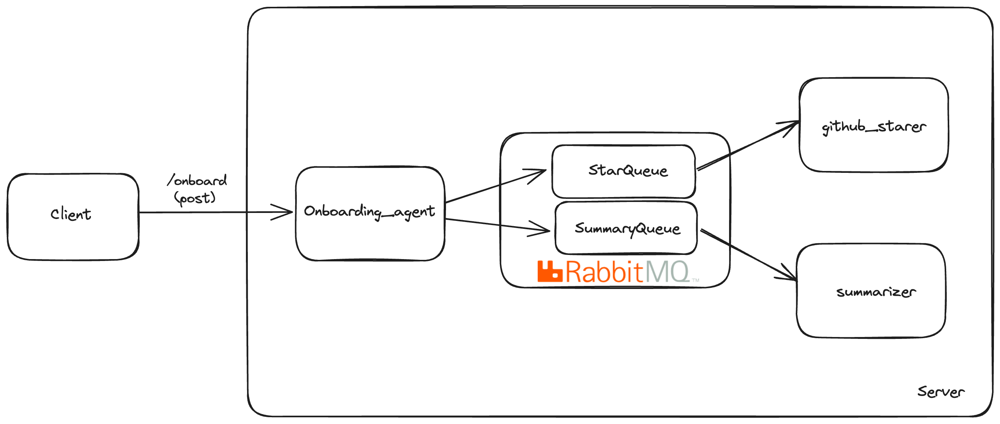

## Introduction
This samples shows a sample microservices where we onboard a new ballerina developer to the team. This application contains three microservices.

1. onboarding_agent - This is the main service which coorinates the onboarding process. This service is exposed to the user via HTTP.
2. github_starer - This service is responsible for starring all the repos in a given org.
3. summarizer - This service is responsible for summerizing the readme contents in each repo of a given org.

## Architecture



## Prerequisites
1. Ballerina Swan Lake Update 8
2. Docker
3. Openai API Token - https://platform.openai.com/account/api-keys
4. Github PAT Token(With Repo scope) - https://github.com/settings/tokens/new
5. VSCode

## Steps to Run

1. Clone the repository - git clone https://github.com/xlight05/iit_ballerina_session
2. Create a file named `Config.toml` inside `summarizer`directory and add the following entry. Replace the values with your own OpenAI token. `openAIToken = "sk-xxx"`
3. Run RabbitMQ instance via docker by executing `docker run -it --rm --name rabbitmq -p 5672:5672 -p 15672:15672 rabbitmq:3.12-management`
4. Open a new terminal, go to `github_starer` directory and run `bal run`
5. Open a new terminal, go to `summarizer` directory and run `bal run`
6. Open a new terminal, go to `onboarding_agent` directory and run `bal run`

## Executing the service
1. Execute the post endpoint to start the onboarding process. 
```bash
curl --location 'http://localhost:9092/onboard' \
--header 'Content-Type: application/json' \
--data '
{
    "uid" : "{{your_name_here}}",
    "org" : "ballerina-platform",
    "token" : "{{Github_PAT}}"
}'
```

2. Execute the get endpoint to get the status of the onboarding process. 
```bash
curl --location 'localhost:9092/onboard/status?uid=1abc'
```

### (TODO) Writing the Client

The objective is to write a ballerina HTTP client to connect to the onboard_agent HTTP service. You basically need to do the same thing as the above curl command but with ballerina.

1. Create a ballerina package `bal new client`
2. Refer to the following example `https://ballerina.io/learn/by-example/http-client-send-request-receive-response/`
